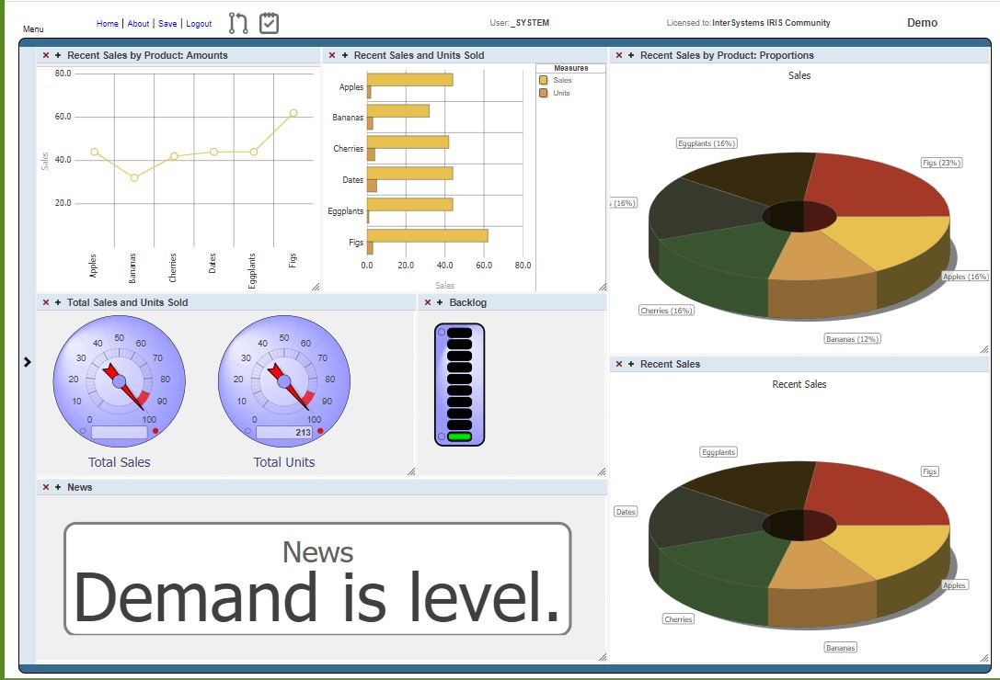

# Deploy tools

Easy way to deploy your production in IRIS or Ensemble.

## The idea

Usualy, if you want to deploy a solution, you need to add the items, configure your lookup tables and default configuration manually.
It's okay if you have all the permissions and privileges to perform these actions. If you want to deploy to a client's production server, and you don't have the permissions, you need to indicate in a document ALL the steps that the deployment manager has to perform.
Therefore, once again, the deployment manager must manually enter the production items, the lookup tables, the default configuration, etc...

You can create an installation class that indicates all the steps automatically and avoid errors in the deployment.

## Prerequisites

Make sure you have [git](https://git-scm.com/book/en/v2/Getting-Started-Installing-Git "git") installed.

## Installation

- Clone/git pull the repo into any local directory

```powershell

git clone https://github.com/KurroLopez/iris-deploy-tools.git .\iris-deploy-tools

```

- Create a namespace with ***Enable namespace for interoperability productions*** checked.
- Download [iris-deploy-tools.xml](https://github.com/KurroLopez/iris-deploy-tools/blob/master/Release/iris-deploy-tools.xml) from Release folder
- Install it by terminal or import directly in manager portal Classes

```objectscript

do $system.OBJ.Load("c:\temp\iris-deploy-tools.xml","ck")

```

## How to use

If you use a class to perform the installation, it must be extended with the **St.Tools.Deploy** class. In this class we can indicate the default PRODUCTION that must be used.
However, you can call the methods by passing the PRODUCTION parameter in the methods that need it.

### Add item to production

Add an item to the production, setting the class, item name and comment.

```objectscript

Do ..AddItem("MySolution.Production", "Item1","myPath.MyClass","Internal")

/// if you have defined a default production

Parameter PRODUCTION = "MySolution.Production";
Do ..AddItem(, "Item1","myPath.MyClass","Internal")

```

### Remove item to production

Removes an item from production if this item is obsolete because improvements have been made in this version.

```objectscript

Do ..RemoveItem("MySolution.Production", "Item1")

/// if you have defined a default production

Parameter PRODUCTION = "MySolution.Production";
Do ..RemoveItem(, "Item1")

```

### Insert or update a default value

Add a default setting or update its value.

```objectscript

Do ..AddDefaultSetting("MySolution.Production", "Host.RS.Rest",,"Port","21")
/// Add new default setting for all productions.
Do ..AddDefaultSetting(,"Host.RS.Rest",,"Port","21",1)

/// if you have defined a default production
Do ..AddDefaultSetting(, "Host.RS.Rest",,"Port","21")

```

### Remove a default value

```objectscript

Do ..RemoveDefaultSetting("MySolution.Production", "Host.RS.Rest",,"Port")
/// remove default setting for all productions.
Do ..RemoveDefaultSetting(,"Host.RS.Rest",,"Port",1)

/// if you have defined a default production
Do ..RemoveDefaultSetting(, "Host.RS.Rest",,"Port"")

```

### Add an item into a lookup table

Add a value into a lookup table. If it exists, replace the value. If doesn't exist the table name, it'll be created in this moment.

```objectscript

set itemCount = 0
set pList($Increment(itemCount))=$Listbuild("MyTable","Campo1","Valor1")
set pList($Increment(itemCount))=$Listbuild("MyTable","Campo2","Valor2")
set pList($Increment(itemCount))=$Listbuild("MyTable","Campo3","Valor3")
set pList($Increment(itemCount))=$Listbuild("MyOtherTable","Campo","Valor")
set pList = itemCount
do ..AddLookupTable(pList)

```

### Remove an item from a lookup table

```objectscript

set itemCount = 0
set pList($Increment(itemCount))=$Listbuild("MyTable","Campo1")
set pList($Increment(itemCount))=$Listbuild("MyTable","Campo2")
set pList($Increment(itemCount))=$Listbuild("MyTable","Campo3")
set pList($Increment(itemCount))=$Listbuild("MyOtherTable","Campo")
set pList = itemCount
do ..RemoveLookupTable(pList)

```

### Register a web application

Register a web application. Configurate a service that doesn't need a special configuration.
By default, it uses %All roles.

```objectscript

Do ..RegisterWebApplication("SAMPLES","/myApp/api","Host.RS.Rest","This is my api rest")

```

### Remove a web application

```objectscript

Do ..RemoveWebApplication("/myApp/api","Host.RS.Rest")

```

### Add a schedule task

You can create a schudule task easy using a properties class.

```objectscript
set task = ##class(St.Tools.Task.Properties).%New()
set task.Name = "UpdateDocuments"
set task.TaskClass = "MySolution.Task.UpdateDocuments"
set task.Period = ##class(DKV.Common.Task.Item.Period).#Daily
set task.DailyFrequency = ##class(DKV.Common.Task.Item.DailyFrequency).#Once
set task.DailyStartTime = 0
set task.TimePeriodEvery = 1
set task.StartDate = $ZDATEH($SYSTEM.SQL.Functions.DATEADD("d",1,$HOROLOG),3)  // Start next day
set ret = ..AddTask(task, .idTask)

/// As it is the first time it is installed, we run the task for the first time
Do $SYSTEM.Task.RunNow(idTask)
```

## Docker Demo

#### Prerequisites

Make sure you have [Docker desktop](https://www.docker.com/products/docker-desktop) installed.  

#### Installation

From your GitHub download directory build and run the IRIS container with your project:

```

docker-compose up -d --build

```

You get a fresh IRIS image with an empty production running


This is the core of the well-known Saels demon from ENSDEMO.
<http://localhost:42773/csp/user/EnsPortal.ProductionConfig.zen?PRODUCTION=MySolution.Production>
But nothing to see yet.  
Also not in the Dashboard.
<http://localhost:42773/csp/user/_DeepSee.UserPortal.DashboardViewer.zen?DASHBOARD=Sales%20Dashboard.dashboard>

Next we add the Business Service.  
From console run:  

```

$iris-deploy-tools>docker-compose exec iris iris session iris

Node: 5a7e5bcc8f12, Instance: IRIS
USER>do ##class(St.Tools.Deploy).AddItem("MySolution.Production","SalesMetrics","MySolution.SalesMetrics")

Installing SalesMetrics
13:11:21.920:Ens.Director: RestartProduction initiated.
13:11:21.921:Ens.Director: StopProduction initiated.
13:11:21.931:Ens.Director: Production 'MySolution.Production' stopped.
13:11:21.937:Ens.Director: Production 'MySolution.Production' starting...
13:11:21.972:Ens.Director: Production 'MySolution.Production' started.
13:11:21.974:Ens.Director: RestartProduction complete.
Item SalesMetrics installed.
USER>
```

and now reload your production view  
<http://localhost:42773/csp/user/EnsPortal.ProductionConfig.zen?PRODUCTION=MySolution.Production>

Now we have a business service  
And it delivers input to the Dashboard.

<http://localhost:42773/csp/user/_DeepSee.UserPortal.DashboardViewer.zen?DASHBOARD=Sales%20Dashboard.dashboard>

It is up to you to proced with your own code.
